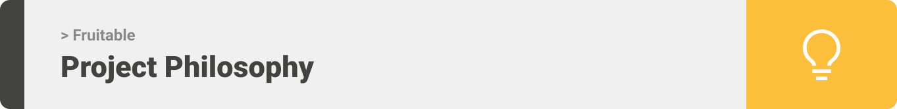
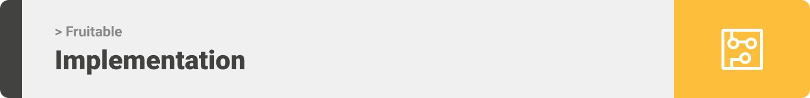

<div align="center">

> Hello world! This is the project’s summary that describes the project plain and simple, limited to the space available. 


**[PROJECT PHILOSOPHY](https://github.com/julescript/well_app#-project-philosophy) • [WIREFRAMES](https://github.com/julescript/well_app#-wireframes) • [TECH STACK](https://github.com/julescript/well_app#-tech-stack) • [IMPLEMENTATION](https://github.com/julescript/well_app#-impplementation) • [HOW TO RUN?](https://github.com/julescript/well_app#-how-to-run)**

</div>

<br><br>




> Fruitable is all what you need to make grocery shopping easy and time saving.
The app is made to locate the nearby groceries that carries the goods you're looking for. With every purchase, a delivery tracking system is triggered to assist you in keeping track of your order.
> 
> Fruitable is a tool designed also for grocery store owners, allowing them to input their data and display their products to customers. Owners can communicate with one another via the website's chat feature.

### User Stories
- As a user, I want to shop from the nearest grocery.
- As a user, I want to get notified upon ordering.
- As a user, I want to track my order.

### Seller Stories
- As a seller, I want to register using new technology: optical character recognition.
- As a seller, I want to fill my stock.
- As a seller, I want to make a real time chat with other stores.

<br><br>


> This design was planned before on paper, then moved to Figma app for the fine details.
Note that i didn't use any styling library or theme, all from scratch and using pure css modules

| Home  | Grocery  |
| -----------------| -----|
|  |  |

| Reviews  | Chat  |
| -----------------| -----|
|  |  |


<br><br>


Here's a brief high-level overview of the tech stack the Fruitable app uses:

- This project uses the [React app development framework](https://reactjs.org/). React makes it painless to create interactive UIs. Design simple views for each state in your application, and React will efficiently update and render just the right components when your data changes.
- In addition to [React native framework](https://reactnative.dev/). React Native combines the best parts of native development with React, a best-in-class JavaScript library for building user interfaces.You can use React Native today in your existing Android and iOS projects or you can create a whole new app from scratch.
<!-- - For persistent storage (database), the project uses the [Hive](https://hivedb.dev/) package which allows the project to create a custom storage schema and save it to a local database. -->
- To send remote push notifications, the project uses the [firebase_cloud_messaging](https://firebase.google.com/products/cloud-messaging/) package which provides a reliable and battery-efficient connection between your server and devices that allows you to deliver and receive messages and notifications on iOS, Android, and the web at no cost!
- The project uses ["Socket package"](https://socket.io/) to implement the real time chat feature, where socket package creates the communication channel, and the channel is used to send data between application programs either locally or over networks.


<br><br>


> Uing the above mentioned tech stacks and the wireframes build with figma from the user sotries we have, the implementation of the app is shown as below, these are screenshots from the real app

<br>

# User Mobile App Implementation

| Sign up  | Login  |
| -----------------| -----|
|  |  |

| View Groceries  | View Recent Reviews  |
| -----------------| -----|
|  |  |

| Submit Review  | Firebase Notification After Making an Order  |
| -----------------| -----|
|  |  |

| Update Account  | Try to Order From Another Grocery  |
| -----------------| -----|
|  |  |

<br>

# Seller Web Implementation

| Optical Recognition Technology Registration
| -----------------|
| 

| Socket Real Time Chat
| -----------------|
|  

| Add to Stock
| -----------------|
|  

| Manage Orders
| -----------------|
|  

| Edit Item
| -----------------|
|  

| Remove Item
| -----------------|
|  

| Update Account
| -----------------|
|  

| Login
| -----------------|
|  


<br><br>


<!-- > This is an example of how you may give instructions on setting up your project locally.
To get a local copy up and running follow these simple example steps.

### Prerequisites

This is an example of how to list things you need to use the software and how to install them.
* npm
  ```sh
  npm install npm@latest -g
  ```

### Installation

_Below is an example of how you can instruct your audience on installing and setting up your app. This template doesn't rely on any external dependencies or services._

1. Get a free API Key at [https://example.com](https://example.com)
2. Clone the repo
   ```sh
   git clone https://github.com/your_username_/Project-Name.git
   ```
3. Install NPM packages
   ```sh
   npm install
   ```
4. Enter your API in `config.js`
   ```js
   const API_KEY = 'ENTER YOUR API';
   ``` -->

